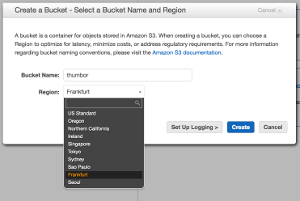

#Thumbor on Elastic Beanstalk with Docker

##Prerequisite

- AWS account
	- IAM creation access
	- S3 Full access
	- Elastic Beanstalc full access
	- Cloudfront full access (optional)

- Skills
	- at least rough knowledge about AWS services

	
	
##Scope
scope of this document is a step by step guide to deploy thumbor on Elastic Beanstalk utilizing public Docker images of [thumbor](http://thumbor.org/).
In the end this will result in a horizontaly autoscaling setup for fast and relaiable image delivery for any service.

Setup in short:
We are setting up a s3 bucket which is used by thumbor (on beanstalk) to deliver scaled and otimized images to the consumer. Then optionally cloudfront is put on top as CDN.  

__example usecase__: 
I'm using this setup for a project which serves Millions of image requests on less than 1$ per Million request while the delivery is highly dynamic and big chunks especially requests from mobile - which are device specific - are almost not cachable. My experience so far: now downtime, one time setup nothing to manually maintain cost efficient.

##Seting up S3
1. Navigate to [S3](https://console.aws.amazon.com/s3/home) 
2. Create a bucket 

[createBucket]: https://github.com/adam-p/markdown-here/raw/master/src/common/images/icon48.png "Logo Title Text 2"

